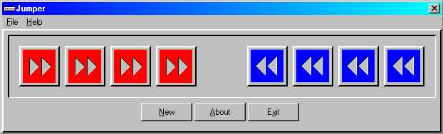



## Jumping Blocks

### Description

Jumper is a puzzle that looks easy but its here to deceive you. It involves eight boxes that have to be manipulated in a certain way and moved to a certain position. Because I've had comments about the help not working. This game was made years ago so I use the old Win3.1 help. I've updated the help and it should work on any Windows version 9x/NT/ME/2000/XP. Full credit to Firas Bushnaq for the idea behind this game.
 
### More Info
 

             |
---                |---
**Submitted On**   |2002-11-16 18:30:48
**By**             |[Keith Stanier](https://github.com/Planet-Source-Code/PSCIndex/blob/master/ByAuthor/keith-stanier.md)
**Level**          |Intermediate
**User Rating**    |4.7 (14 globes from 3 users)
**Compatibility**  |VB 4\.0 \(32\-bit\), VB 5\.0, VB 6\.0
**Category**       |[Games](https://github.com/Planet-Source-Code/PSCIndex/blob/master/ByCategory/games__1-38.md)
**World**          |[Visual Basic](https://github.com/Planet-Source-Code/PSCIndex/blob/master/ByWorld/visual-basic.md)
**Archive File**   |[Jumping\_Bl169027142004\.zip](https://github.com/Planet-Source-Code/keith-stanier-jumping-blocks__1-40773/archive/master.zip)

